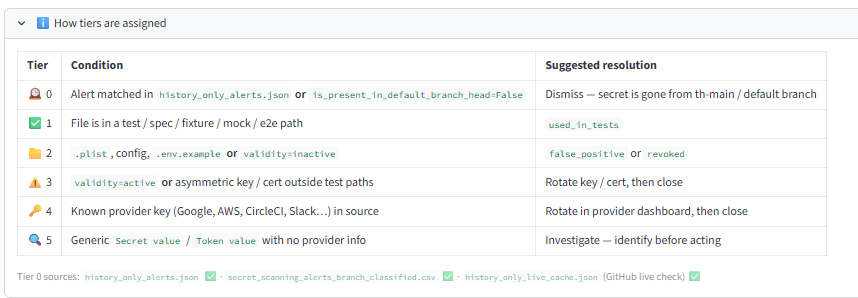
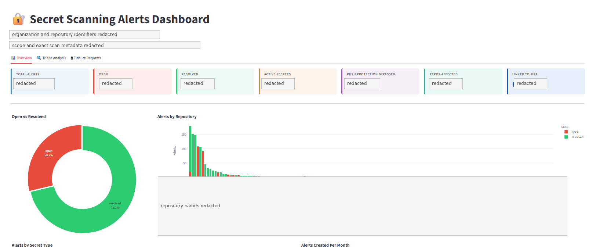
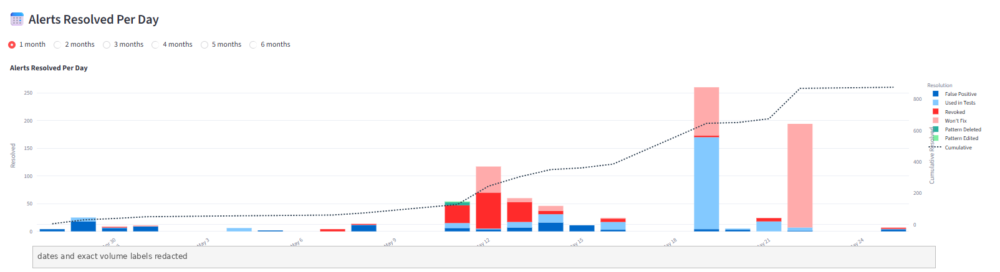
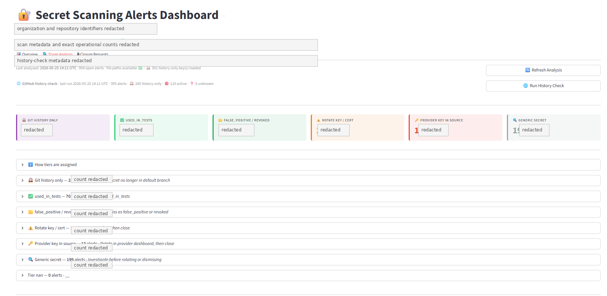
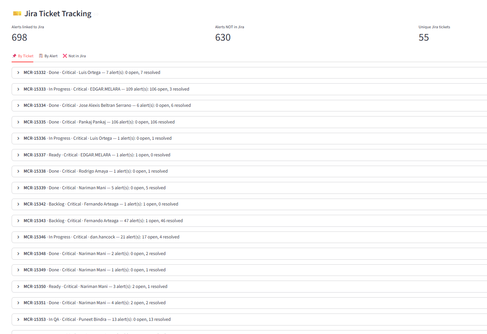

# Secret Scanning Alerts Dashboard

A portfolio case study for a security automation dashboard that I developed to improve visibility, triage, and remediation tracking for GitHub Secret Scanning alerts across a large multi-repository engineering environment.

The solution uses Python-based automation to collect and normalize alert data, cross-check remediation evidence through GitHub and Jira APIs, classify alert severity and closure paths, and apply Claude AI-assisted analysis to support faster investigation and reporting.

> **Public portfolio note:** Screenshots in this repository are redacted. Organization names, repository names, Jira issue keys, assignees, and exact operational metrics have been removed for confidentiality.

---

## Problem

Security teams and engineering leaders often need to manage a high volume of GitHub Secret Scanning alerts across many repositories.

The challenge is not only finding alerts. The real difficulty is answering delivery and governance questions quickly:

- Which alerts are still open?
- Which alerts are already resolved?
- Which alerts are linked to Jira remediation work?
- Which alerts are only historical and no longer exist on the default branch?
- Which findings are test secrets, false positives, revoked credentials, or active secrets?
- Which repositories and teams need follow-up?
- Which alerts require escalation, rotation, or provider-side action?

Manual review becomes slow, inconsistent, and hard to report at scale.

---

## Solution Overview

I built a custom automation and dashboard workflow that integrates GitHub, Jira, and AI-assisted analysis into one operational view.

The dashboard helps security, engineering, and program stakeholders:

- Track open, resolved, active, and bypassed secret scanning alerts.
- Identify repositories with the highest alert concentration.
- Correlate GitHub alert records with Jira remediation tickets.
- Separate historical findings from current default-branch exposure.
- Apply a tiering model to determine the right remediation path.
- Monitor daily resolution progress.
- Support evidence-based security governance reporting.

---

## Technical Implementation

The solution combines security automation, data normalization, API integration, and dashboard reporting.

### Core components

- **Python automation layer**
  - Pulls and normalizes alert data.
  - Processes GitHub Secret Scanning records.
  - Reconciles alert metadata with Jira remediation tickets.
  - Generates structured datasets for dashboard views.

- **GitHub API integration**
  - Retrieves secret scanning alerts.
  - Checks alert state, resolution, repository scope, and provider metadata.
  - Cross-checks whether historical findings still exist in the default branch.
  - Supports repository-level aggregation and trend analysis.

- **Jira API integration**
  - Maps alerts to remediation tickets.
  - Tracks issue status, ownership, and workflow state.
  - Identifies alerts not yet linked to remediation work.
  - Supports audit and governance traceability.

- **Claude AI-assisted analysis**
  - Helps summarize alert patterns.
  - Assists with triage interpretation.
  - Flags inconsistent remediation evidence.
  - Supports executive-ready status narratives and investigation notes.

- **Triage and classification logic**
  - Groups alerts by operational action path.
  - Separates false positives, test secrets, revoked secrets, active secrets, provider keys, and generic secrets.
  - Prioritizes findings that require rotation, investigation, or provider-side remediation.

---

## High-Level Architecture

```text
GitHub Secret Scanning API
        |
        v
Python Collection and Normalization Jobs
        |
        +--> GitHub Default-Branch / History Cross-Checks
        |
        +--> Jira API Correlation
        |
        +--> Claude AI-Assisted Analysis
        |
        v
Structured Alert Dataset
        |
        v
Security Dashboard and Program Reporting Views
```

---

## Screenshot Walkthrough

### 1. Tier Assignment Model

This view documents the classification model used to assign alerts into action-oriented remediation tiers.

The tiering logic helps avoid treating every secret scanning alert the same way. For example, a historical alert that no longer exists in the default branch should follow a different closure path than an active provider key found in source code.



Key design points:

- Historical-only alerts can usually move toward dismissal after validation.
- Test secrets can be categorized separately when they are confirmed safe.
- False positives and revoked secrets follow a closure-oriented path.
- Active asymmetric keys or certificates require rotation before closure.
- Known provider keys require remediation in the provider dashboard.
- Generic secrets require investigation before dismissal or rotation.

---

### 2. Executive Dashboard Overview

This dashboard view provides a high-level summary of the security alert posture across repositories.

It gives leadership and engineering stakeholders a quick view of total alert volume, open and resolved alerts, active secrets, push protection bypasses, affected repositories, and Jira linkage coverage.



This view supports:

- Program-level status reporting.
- Repository-level prioritization.
- Cross-team remediation planning.
- Progress tracking for security initiatives.
- Clear visibility into adoption and remediation outcomes.

---

### 3. Alerts Resolved Per Day

This trend view shows remediation progress over time.

The stacked bar chart separates resolution categories, while the cumulative line shows overall closure progress.



This view is useful for:

- Tracking remediation velocity.
- Showing progress after focused cleanup efforts.
- Identifying days with significant closure activity.
- Supporting program updates and leadership reviews.
- Validating whether security initiatives are producing measurable outcomes.

---

### 4. Triage Analysis

This view groups findings into triage categories based on the recommended remediation path.

It helps engineers and security stakeholders focus on the right next action instead of manually inspecting every alert from scratch.



The triage categories include:

- Git history only.
- Used in tests.
- False positive or revoked.
- Rotate key or certificate.
- Provider key in source.
- Generic secret requiring investigation.

This model improves consistency because each class of alert has a recommended action path.

---

### 5. Jira Ticket Tracking

This view correlates GitHub Secret Scanning alerts with Jira remediation tickets.

It helps determine which alerts already have active remediation work and which alerts still need ticket creation, ownership, or escalation.



This view supports:

- Issue-to-alert traceability.
- Security remediation governance.
- Evidence collection for audit readiness.
- Delivery tracking across matrixed teams.
- Identification of untracked or orphaned remediation work.

---

## Program Management and Security Value

This work directly supports technical program management for security initiatives.

It improves:

- **Portfolio visibility:** Security leadership can see overall posture and remediation progress.
- **Risk management:** Active secrets and unresolved findings can be prioritized.
- **Dependency management:** Jira linkage shows which teams, repositories, and tickets are involved.
- **Delivery governance:** Progress can be tracked against expected outcomes and closure criteria.
- **Audit traceability:** GitHub alerts can be connected to remediation evidence and Jira records.
- **Engineering rigor:** Teams can validate closure against clear acceptance criteria.
- **Continuous improvement:** Triage data exposes recurring failure points and process gaps.

---

## Resume-Ready Summary

- Developed Python-based security automation integrating GitHub Secret Scanning, GitHub API history checks, Jira API remediation tracking, and Claude AI-assisted analysis to classify alerts, validate remediation evidence, and improve cross-team security reporting.
- Built a dashboard-driven triage workflow for secret scanning alerts, including tier assignment, repository-level aggregation, resolution trend analysis, Jira linkage tracking, and governance-ready status reporting.
- Improved vulnerability and secret remediation visibility by correlating alert state, repository ownership, remediation tickets, closure status, and recommended action paths across multiple engineering teams.

---

## Skills Demonstrated

- Technical Program Management
- Security Program Delivery
- Vulnerability and Secret Management
- Application Security
- DevSecOps
- GitHub Advanced Security
- GitHub REST API / GraphQL API Integration
- Jira REST API Integration
- Python Automation
- Data Normalization and Reporting
- AI-Assisted Security Analysis
- Risk, Issue, and Dependency Tracking
- Stakeholder Reporting
- Audit Evidence and Traceability
- Agile Delivery Support

---

## Confidentiality Notice

This repository is a public-safe portfolio representation.

The implementation details, source data, repository names, issue keys, employee names, and organization-specific identifiers have been redacted or generalized. The screenshots show the workflow and dashboard design without exposing confidential operational details.
